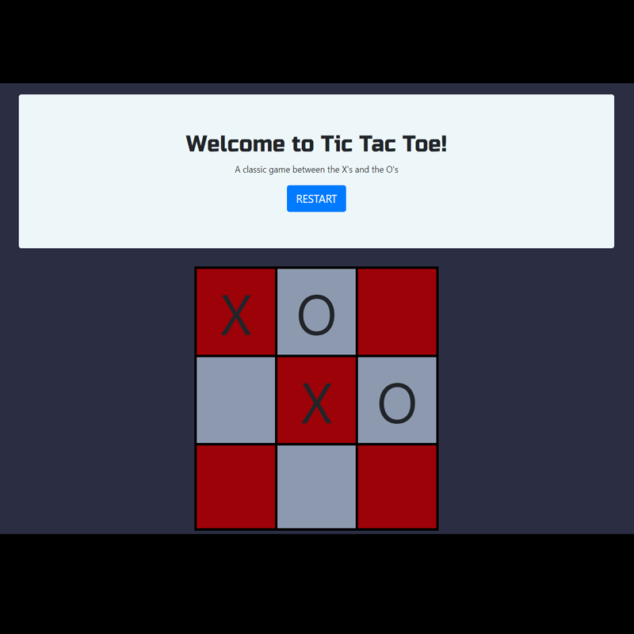

# ticTacToe

>A simple Tic-Tac-Toe program inspired by Jose Portilla's tutorial introduction to Full Stack Development.
This is also for the purpose to learn Github control & technical documentation.

---

### Table of Contents

- [Description](#description)
- [How To Use](#how-to-use)
- [References](#references)
- [Author Info](#author-info)

---

## description

This Tic-Tac-Toe program is created using HTML, CSS, & Javascript. With the addition of CSS, I've also referenced to the Bootstrap framework for additional styling. The Tic-Tac-Toe program is mainly comprised of a Bootstrap jumbotron with a restart button and a tic-tac-toe game-grid created with HTML tables. I used Javascript to create the logic to be able to fill in the game-grid with X's and O's as well as allowing the user to clear the game-grid by clicking on the restart button provided.

#### Technologies

- HTML
- CSS
- Bootstrap
- Javascript

---

## How To Use

I welcome any pull requests to configure and learn to create Tic-Tac-Toe with your own style!

---

## References

https://getbootstrap.com/docs/4.0/components/jumbotron/
https://developer.mozilla.org/en-US/docs/Web/Events
https://www.udemy.com/course/python-and-django-full-stack-web-developer-bootcamp/

---

## Author info

- LinkedIn - [Eric Nguyen](https://www.linkedin.com/in/eric-nguyen-a77977196/)
- Website - [Portfolio](https://ericnguyen-b.github.io/)
